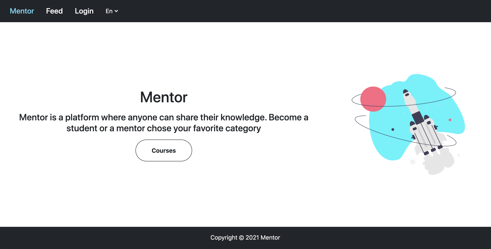

## Mentor

Mentor is a platform where anyone can share their knowledge



## Install application
1. Clone app ``git clone https://github.com/gregurcom/mentor.git``
2. Install all dependence

``composer install``

``npm install``

``npm run dev``

## Testing application
Unit and Feature test

``php artisan test``

Browser Test
1. Set your APP_URL in env. file to:
   ``APP_URL=http://127.0.0.1:8000``
2. ``php artisan serve``
3. ``php artisan dusk``

## Code analysis
1. Run analysis:
```
./vendor/bin/phpstan analyse
```
If you are getting the error `Allowed memory size exhausted`, then you can use the --memory-limit option fix the problem:
```
./vendor/bin/phpstan analyse --memory-limit=2G
```
2. Setting analysis config file:

`phpstan.neon` - a configuration file in which you can change the code analysis rules.For more details check phpstan documentation: https://phpstan.org/user-guide/getting-started
